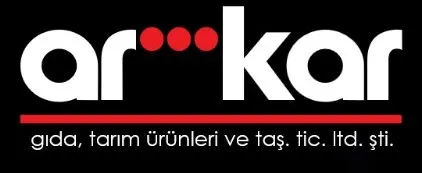

# AR-KAR İnşaat — Kurumsal Web Sitesi ve İçerik Paneli

<div align="center">
  

  [](https://ar-kar.com)
  [](https://astro.build)
  [](https://www.typescriptlang.org/)
  [](https://pages.cloudflare.com/)
  [](https://github.com/yusufarbc/ar-kar/actions/workflows/codeql.yml)
</div>

Samsun Çarşamba'da 1987'den bu yana hizmet veren **AR-KAR GIDA TARIM ÜRÜNLERİ
VE TAŞIMACILIK TİCARET LİMİTED ŞİRKETİ**'nin kurumsal sitesi ve ona bağlı
içerik yönetim paneli. Tek depo, iki dağıtım hedefi:

| Ne | Adres | Cloudflare Pages projesi | Kaynak |
| --- | --- | --- | --- |
| Ana site (statik) | `ar-kar.com`, `www.ar-kar.com` | `ar-kar` | `src/`, `public/` |
| Yönetim paneli | `panel.ar-kar.com` | `ar-kar-admin` | `panel/` |

---

## Mimari

Sitenin tamamı **statiktir** — hiçbir sunucu tarafı rota yoktur. İçerik
düzenleme işi siteye değil, ayrı bir Pages projesi olan panele aittir. Panel
içeriği veritabanına değil **depoya commit eder**; commit CI/CD'yi tetikler,
site yeniden derlenip yayına çıkar. Yani **Git, içerik veritabanının kendisidir.**

```text
  Editör (tarayıcı)
        │  panel.ar-kar.com
        ▼
  ┌──────────────────────────────────────────────────────────┐
  │ Cloudflare Access — kimlik doğrulama (e-posta)           │
  │ WAF kuralı        — yalnızca TR                          │
  └───────────────────────────┬──────────────────────────────┘
                              │  Cf-Access-Jwt-Assertion
                              ▼
  ┌──────────────────────────────────────────────────────────┐
  │ Pages Functions (ar-kar-admin)                           │
  │   _lib/verifyAccess.ts  → JWT imzasını JWKS'e doğrular   │
  │   api/publish.ts        → .md + .webp yazar              │
  │   api/entries.ts        → listele / oku / sil            │
  │   GITHUB_TOKEN yalnızca burada; tarayıcıya gitmez        │
  └───────────────────────────┬──────────────────────────────┘
                              │  GitHub Contents API → production
                              ▼
  ┌──────────────────────────────────────────────────────────┐
  │ GitHub deposu — src/content/**.md + public/img/**.webp   │
  └───────────────────────────┬──────────────────────────────┘
                              │  push
                              ▼
  ┌──────────────────────────────────────────────────────────┐
  │ GitHub Actions — ci-cd.yml                               │
  │   Kod: test → build → deploy                             │
  │   CMS: doğrudan build → deploy                           │
  │   Panel deploy: yalnızca panel/ değiştiyse               │
  └───────────────────────────┬──────────────────────────────┘
                              ▼
                         ar-kar.com
```

### Tasarım kararları ve gerekçeleri

- **Statik çıktı (`output: 'static'`).** Sunucu tarafı rota yok; Pages'e düz
  dosya olarak yüklenir. Saldırı yüzeyi ve çalıştırma maliyeti sıfıra yakın.
- **`build.format: 'file'`.** Sayfalar `insaat.html`, `pvc.html` biçiminde
  üretilir; eski statik sitenin URL yapısı korunur. Cloudflare Pages bu
  adresleri otomatik olarak uzantısız hâline 308 ile yönlendirir.
- **Panel ayrı bir Pages projesinde.** Ana sitede panel rotası hiç bulunmaz ve
  `GITHUB_TOKEN` ile aynı dağıtımı paylaşmaz. Ana siteye ulaşan trafik, yazma
  yetkisi olan koda hiçbir noktada değmez.
- **İçerik commit'i = dağıtım tetiği.** Ayrı bir CMS veritabanı, ayrı yedek ve
  ayrı senkronizasyon derdi yok; içeriğin sürüm geçmişi Git geçmişidir.

---

## Depo yapısı

```text
ar-kar/
├── astro.config.mjs          # SSG yapılandırması (site, output, build.format)
├── tsconfig.json             # Astro strict — panel/ hariç tutulur
├── tsconfig.panel.json       # Pages Functions için ayrı tip kontrolü
│
├── src/                      # ── ANA SİTE ───────────────────────────────
│   ├── pages/                #   dosya tabanlı rotalar
│   │   ├── index.astro       #     ana sayfa (hero carousel + bento)
│   │   ├── insaat · pvc · mimar · muteahhitlik · tarim · ziraat · sss
│   │   ├── hakkimizda.astro  #     kurumsal hikâye + AboutPage şeması
│   │   ├── iletisim.astro    #     adresler, harita, ContactPage şeması
│   │   ├── projeler.astro    #     proje listesi (kategoriye göre)
│   │   ├── projeler/[slug].astro
│   │   ├── blog/index.astro  #     "Haberler"
│   │   ├── blog/[slug].astro
│   │   ├── sitemap.xml.ts    #     derleme anında üretilen sitemap
│   │   └── robots.txt.ts     #     ortama göre üretilen robots.txt
│   ├── layouts/BaseLayout.astro   # <head>, SEO/OG/geo meta
│   ├── components/           #   Navbar, Footer, PageHeader
│   ├── content.config.ts     #   koleksiyon tanımları + Zod şemaları
│   ├── content/              #   panelin yazdığı markdown
│   │   ├── blog/<slug>/index.md
│   │   └── projects/<slug>/index.md
│   ├── lib/projects.ts       #   PROJECT_CATEGORIES sabiti
│   └── lib/company.ts        #   kuruluş yılı, ünvan, şube ve iletişim bilgileri
│
├── public/                   # ── OLDUĞU GİBİ KOPYALANAN VARLIKLAR ───────
│   ├── css/                  #   style → design-system → bento → responsive
│   ├── img/                  #   görseller (blog/, projects/ alt dizinleri)
│   ├── lib/                  #   yalnızca lightbox (diğerleri kaldırıldı)
│   ├── _redirects            #   Pages yönlendirme kuralları
│   ├── _headers              #   güvenlik + önbellek HTTP başlıkları
│   └── humans.txt · llm.txt · llms.txt · favicon.ico
│
├── panel/                    # ── YÖNETİM PANELİ (ayrı Pages projesi) ────
│   ├── public/index.html     #   tek dosyalık arayüz, bağımlılıksız
│   └── functions/
│       ├── _lib/verifyAccess.ts   # Access JWT imza doğrulaması
│       └── api/publish.ts · api/entries.ts
│
├── scripts/
│   ├── setup-cloudflare.sh   #   altyapı kurulumu (idempotent)
│   └── build-staging.mjs     #   PUBLIC_DEPLOY_ENV=staging ile derleme
└── .github/workflows/
    ├── ci-cd.yml             #   test kapısı + iki dağıtım işi
    └── codeql.yml            #   zafiyet taraması
```

---

## İçerik modeli

İki koleksiyon var; ikisi de Astro'nun `glob` yükleyicisiyle okunur ve Zod ile
doğrulanır (`src/content.config.ts`). Şema tutmayan bir dosya **derlemeyi
kırar** — yani bozuk içerik yayına çıkamaz.

| Koleksiyon | Dizin | Alanlar |
| --- | --- | --- |
| `blog` | `src/content/blog/<slug>/index.md` | `title`, `date`, `description?`, `coverImage?`, `gallery?` |
| `projects` | `src/content/projects/<slug>/index.md` | `title`, `category` (`insaat` / `pvc` / `mimar`), `location?`, `specs?`, `date?`, `description?`, `coverImage?`, `gallery?` |

`date` alanı hem ISO string hem `Date` kabul eder ve `YYYY-MM-DD` biçimine
indirgenir. Proje kategorileri `src/lib/projects.ts` içinde tutulur —
`content.config.ts` Astro tarafından özel olarak ele alındığı için oradan
import etmek derlemeyi bozar.

---

## Yönetim paneli

`panel/public/index.html` tek dosyalık, derleme adımı olmayan bir arayüz:
koleksiyon sekmeleri, markdown araç çubuğu ve önizleme, kapak görseli ile
en fazla 8 görsellik galeri, düzenleme ve silme.

Görseller **tarayıcıda** `canvas.toBlob` ile WebP'ye çevrilip base64 olarak
gönderilir; sunucu tarafında görüntü işleme yapılmaz.

### Güvenlik zinciri

Panel, yazma yetkisi olan tek bileşen olduğu için katmanlı kurgulanmıştır:

1. **Cloudflare Access** — `panel.ar-kar.com` özel adını e-posta ile korur.
2. **WAF kuralı** — panel adına yalnızca TR'den erişime izin verir.
3. **JWT imza doğrulaması** — `_lib/verifyAccess.ts`, `Cf-Access-Jwt-Assertion`
   header'ının imzasını Cloudflare'in JWKS uç noktasına karşı doğrular
   (RS256, `exp` kontrolü, 1 saatlik anahtar önbelleği).

Üçüncü madde kritiktir: Access yalnızca özel adı korur, projenin ham
`*.pages.dev` adresi **korunmaz**. İmza doğrulanmasaydı internetteki herkes
sahte bir header uydurup API'leri doğrudan çağırabilir ve `GITHUB_TOKEN`'ın
yetkisiyle içerik yazabilirdi.

`GITHUB_TOKEN` yalnızca Pages ortam değişkeni olarak yaşar ve hiçbir koşulda
tarayıcıya gönderilmez. Panelin attığı commit'ler `cms:` ve `media:` önekiyle,
işlemi yapan editörün e-postasıyla birlikte kayda geçer.

---

## CI/CD

`.github/workflows/ci-cd.yml` — `production` ve `staging` push'larında ve
`production` hedefli PR'larda çalışır.

| İş | Koşul | Yaptığı |
| --- | --- | --- |
| `test` | PR'lar ve normal kod push'ları | `astro check && astro build`, `tsc -p tsconfig.panel.json`, `dist/index.html` + `dist/sitemap.xml` doğrulaması |
| `deploy-site` | normal push'ta test sonrası; `cms:` commitinde doğrudan | Zorunlu production build'i alır ve `wrangler pages deploy dist --project-name=ar-kar` çalıştırır |
| `deploy-panel` | normal push + `production` + `panel/` değiştiyse | `wrangler pages deploy public --project-name=ar-kar-admin` |

Notlar:

- Normal kod değişikliklerinde `test` zorunlu kapıdır; başarısız olursa dağıtım çalışmaz.
- Panelin son içerik commit'i `cms:` ile başlar; quality gate atlanır ve site
  gerekli tek build'in ardından doğrudan yayınlanır. Görsel yüklerken oluşan
  ara `media:` commitleri test/deploy başlatmaz; son `cms:` deploy'u bunları da içerir.
- Bu hızlı yol yalnızca değişen dosyaların tamamı `src/content/**` veya
  `public/img/**` altındaysa açılır. Aynı push kod değişikliği de içeriyorsa
  commit mesajından bağımsız olarak tam quality gate zorunludur.
- Dağıtımda `cloudflare/wrangler-action` yerine projenin kendi `wrangler`'ı
  kullanılır — action kendi sürümünü kurup `@cloudflare/workers-types` ile
  peer çakışması yaratıyordu.
- `--skip-caching` bilinçli bir geçici çözümdür: Cloudflare'in
  `POST /pages/assets/check-missing` uç noktası kalıcı 500 vermeye başladı.
  Bayrak dosya-hash önbelleğini atlar; proje küçük olduğu için (~143 dosya)
  maliyeti önemsizdir.
- `deploy-panel`, push öncesi ve sonrası farkına bakarak yalnızca `panel/` değiştiğinde
  koşar; içerik commit'leri paneli gereksiz yere yeniden dağıtmaz.
- `codeql.yml`, `src/content/**` ve `public/img/**` yollarını yoksayar —
  panelden gelen içerik commit'leri kod değiştirmediği için tarama atlanır.
  Haftalık tam tarama (Pazartesi 03:30 UTC) kapsamı korur.

---

## Ortamlar

| Ortam | Dal | Adres | Davranış |
| --- | --- | --- | --- |
| Production | `production` | `ar-kar.com` | İndekslenir, canlı |
| Staging | `staging` | `staging.ar-kar.pages.dev` | `noindex` + `Disallow: /` + uyarı şeridi |

Ortamı tek bir değişken belirler: **`PUBLIC_DEPLOY_ENV`**. Tanımlı değilse
`production` varsayılır — yani yerel `npm run build` ve elle yapılan her
derleme canlı davranışını üretir, kazara noindex'li çıktı oluşmaz.

Bu değişken üç yeri birden besler:

| Dosya | Staging'de ne değişir |
| --- | --- |
| [astro.config.mjs](astro.config.mjs) | `site` → `https://staging.ar-kar.pages.dev` |
| [src/layouts/BaseLayout.astro](src/layouts/BaseLayout.astro) | `robots` meta → `noindex, nofollow`; canonical origin staging'e döner; sayfanın üstüne "ÖNİZLEME ORTAMI" şeridi eklenir |
| [src/pages/robots.txt.ts](src/pages/robots.txt.ts) | Tüm site taramaya kapatılır (`Disallow: /`) |

Canonical adresler sayfalarda tam adresle yazılıdır
(`https://ar-kar.com/insaat` gibi); BaseLayout yalnızca **origin** kısmını
bulunulan ortamla değiştirir, yol kısmı korunur. Böylece 12 sayfayı tek tek
düzenlemeye gerek kalmaz.

Staging'i yerelde derlemek için:

```bash
npm run build:staging      # PUBLIC_DEPLOY_ENV=staging ile derler
npm run preview            # dist/ çıktısını yerelde sunar
```

> `PUBLIC_DEPLOY_ENV=staging npm run build` yazmak yerine ayrı bir script
> olmasının sebebi Windows'tur: npm komutları cmd.exe ile koştuğu için satır
> başındaki değişken ataması orada hata verir.
> [scripts/build-staging.mjs](scripts/build-staging.mjs) değişkeni Node
> tarafında ayarlar, ek bağımlılık gerektirmez.

---

> **Uyarı:** Panel doğrudan `production` dalına commit atar. Bu dalda `--force`
> push **yapılmamalıdır**; yayınlanmış içerik geri dönüşsüz kaybolur.

---

## Yerel geliştirme

Gereksinim: Node.js ≥ 22.12.

```bash
npm ci
npm run dev        # http://localhost:4321
```

| Komut | Açıklama |
| --- | --- |
| `npm run dev` | Astro geliştirme sunucusu |
| `npm run build` | `dist/` üretir (production davranışı) |
| `npm run build:staging` | `dist/` üretir (noindex + staging adresleri) |
| `npm run preview` | Derlenmiş çıktıyı yerelde sunar |
| `npm run check` | Astro tip kontrolü |
| `npm test` | `check` + `build` — CI'daki kapının aynısı |
| `npm run deploy:production` | Elle dağıtım (normalde CI yapar) |
| `npm run deploy:staging` | Staging'e elle dağıtım |
| `npm run panel:deploy` | Paneli elle dağıtır |

Panel fonksiyonlarını yerelde çalıştırmak için:

```bash
cd panel && npx wrangler pages dev public
```

`_lib/` altındaki dosyalar Pages Functions tarafından rota olarak yorumlanmaz
(alt çizgiyle başlayan dizinler hariç tutulur); yalnızca diğer fonksiyonlardan
import edilir.

---

## Altyapı kurulumu

`scripts/setup-cloudflare.sh` Cloudflare tarafını idempotent biçimde kurar:
custom domain bağlamaları, panel için yurtdışı engelleyici WAF kuralı ve
yönlendirme kuralı. Bağımlılığı yalnızca `bash`, `curl` ve `node`'dur
(`jq` gerekmez); Windows'ta Git Bash ile çalışır.

```bash
export CLOUDFLARE_API_TOKEN=...
export CLOUDFLARE_ACCOUNT_ID=...
export CLOUDFLARE_ZONE_ID=...

bash scripts/setup-cloudflare.sh              # tüm adımlar
bash scripts/setup-cloudflare.sh --dry-run    # yalnızca planı yazdır
bash scripts/setup-cloudflare.sh domains waf  # seçili adımlar
```

Adımlar: `deploy` · `domains` · `waf` · `redirect` · `verify`.
Gereken API token izinleri script'in başlığında listelidir.

Ortam değişkenleri için `.env.example` dosyasına bakın. CI tarafında
`CLOUDFLARE_API_TOKEN` ve `CLOUDFLARE_ACCOUNT_ID` GitHub Secrets olarak,
panel tarafında `GITHUB_TOKEN` Pages ortam değişkeni olarak tanımlıdır.

---

## URL yapısı ve yönlendirmeler

`public/_redirects` eski ve alternatif adresleri korur: `/anasayfa` → `/`,
`/projelerimiz` → `/projeler`, `/haberler` → `/blog` gibi. Kaldırılan hizmetler
(`/otomotiv`, `/dekorasyon`) arama motorlarında indekslenmiş olabileceği için
ana sayfaya 301'lenir. `/panel` ve `/admin` kısayolları `panel.ar-kar.com`
adresine 302 ile gider.

Eski `.html` adresleri için kural yazmaya gerek yoktur — Cloudflare Pages
bunları otomatik olarak uzantısız hâline 308 ile yönlendirir.

---

## Performans ve SEO kararları

Bu bölüm, siteyi hazır şablon hâlinden ayıran ve kolayca geri kaybedilebilecek
kararları kayda geçirir.

**Koyu tema.** Site marka paletine (#E71E24 / #000000 / #FFFFFF) geçirildi ve
sayfa zemini siyah oldu. Ayrıntı ve tuzaklar için aşağıdaki *Tasarım sistemi*
bölümüne bakın.

**Ölü kütüphaneler kaldırıldı.** `public/js/main.js` şablonun orijinaliydi ve
sitede hiç bulunmayan öğeleri hedefliyordu (`.date`/`.time` datetimepicker,
`.testimonial-carousel`, `.back-to-top`, `#portfolio-flters`). Bu yüzden her
sayfa moment.js, moment-timezone, tempusdominus, owlCarousel, isotope, easing
ve waypoints yüklüyordu — **~900 KB, sıfır işlev**. Hepsi silindi. Geriye
gerçekten kullanılan üçü kaldı: jQuery (lightbox2'nin zorunluluğu), Bootstrap
bundle (modal/dropdown/collapse/carousel/accordion) ve lightbox. Sayfa başına
script sayısı 10'dan 4'e düştü.

**Tek ikon seti.** Bootstrap Icons kaldırıldı; sitede yalnızca 9 yerde
kullanılıyordu (Font Awesome'da 172) ve ikinci bir font + ikinci bir CDN
bağlantısına değmiyordu.

**Görseller.** Çoğu dosya 2048×2048 iken kartlarda ~300px gösteriliyordu.
Hepsi en fazla 1600px'e indirildi ve yeniden kodlandı: **13.2 MB → 7.5 MB**.
Ana sayfadaki proje kartları ayrıca 480w/960w varyantlarla `srcset` kullanır.

**Tek gerçeklik kaynağı.** Tecrübe yılı 12 dosyada elle "36" yazılıydı ve
yanlıştı (1987 kuruluş → 2026'da 39). Artık `src/lib/company.ts` içinde
hesaplanır; ünvan, şube adresleri, telefonlar ve çalışma saatleri de aynı
dosyadan gelir. Ana sayfadaki proje sayacı da koleksiyondan sayılır.

**Yapısal veri.** `BreadcrumbList` artık `PageHeader` bileşeninden üretilir —
breadcrumb'ı gösteren her sayfa şemasını da otomatik alır ve ikisi asla
birbirinden sapmaz. Sayfalara elle gömülmüş kopyalar kaldırıldı. SSS sayfası
`FAQPage` şemasını ekrandaki akordiyonla **aynı diziden** üretir; Google
işaretlemenin görünen içerikle birebir aynı olmasını şart koşar.

> **Kaldırılan işaretleme:** Ana sayfadaki `LocalBusiness` şemasında
> `aggregateRating` (4.8 / 127 değerlendirme) vardı ama sitede tek bir müşteri
> yorumu yoktu. Google'ın politikası, sayfada görünmeyen ve firmanın kendi
> verdiği puanları yasaklar; bu işaretleme manuel işlem riski taşıyordu.
> Gerçek yorumlar toplanıp sayfada gösterilirse tekrar eklenebilir.

**Dokunmatik cihazlar.** Proje kartlarının açıklaması `:hover` ile açılıyordu.
`style.css` bunu ≤767px için çözüyordu ama 768px ve üzeri dokunmatik
cihazlarda (tabletler) içerik hiç erişilemiyordu. `responsive.css` içindeki
`@media (hover: none) and (min-width: 768px)` kuralı bu boşluğu kapatır.

---

## Tasarım sistemi

CSS yükleme sırası anlamlıdır: `style.css` → `design-system.css` →
`bento.css` → `responsive.css`.

**Marka paleti** logodan örneklenen üç renkten oluşur:

| Rol | Değer | Jeton |
| --- | --- | --- |
| Vurgu | `#E71E24` | `--arkar-red` |
| Sayfa zemini | `#000000` | `--arkar-black` |
| Birincil metin | `#FFFFFF` | `--arkar-white` |

Site **koyu temadır**; sayfa zemini saf siyahtır. Mürekkep skalası ters
çevrilmiştir ama anlamını korur: `--ink-900` her zaman "zemine karşı en yüksek
kontrast" demektir (açık temada en koyu gri, koyu temada beyaz), `--ink-100`
ise kenarlık rengidir. Bu sayede jetonları kullanan her dosya tek satır
değiştirmeden koyu temaya geçti.

Zeminler dört kademelidir: sayfa `#000`, kartlar `--surface`, vurgulu bölümler
`--surface-alt`, koyu paneller `--surface-raised`. Saf siyah üzerine saf siyah
kart hiçbir derinlik bırakmaz; koyu arayüzde ayrım gölgeyle değil zemin
kademesi ve kenarlıkla kurulur.

Başlıklar Plus Jakarta Sans, gövde metni Inter. Carousel ve bento gibi yapısal
parçalar ayrı bileşen dosyalarındadır.

> **Koyu temaya dokunurken dikkat:**
>
> - Bootstrap'in `.bg-light`, `.bg-white`, `.text-muted`, `.btn-light` gibi
>   yardımcı sınıfları sabit açık renkler taşır; jeton değiştirmek onları
>   etkilemez. Karşılıkları [design-system.css](public/css/design-system.css)
>   içinde tanımlıdır, yeni bir renk sınıfı kullanılacaksa oraya da eklenmeli.
> - Başlık **sınıfları** (`.h1` … `.h6`) `bootstrap.red.css` tarafından koyu
>   renklendirilir ve sınıf seçicisi element seçicisinden güçlüdür; bu yüzden
>   tema kuralında hem elementler hem sınıflar listelenmiştir.
> - `--dark` ve `--light` artık **zemin** jetonlarıdır, metin rengi olarak
>   kullanılmamalıdır.
> - Marka logoları beyaz zemin için tasarlandığından iş ortağı ızgarasındaki
>   kutular bilerek beyazdır — siyah üzerinde okunmuyorlardı.

---

## Hizmet alanları

**İnşaat & Mimarlık** — konut projeleri, anahtar teslim inşaat, mimari proje,
hırdavat ve inşaat malzemeleri, PVC kapı/pencere sistemleri.

**Tarım & Ziraat** — tarım ürünleri alım satımı, zirai ilaç, gübre ve tohum,
tarımsal danışmanlık.

Öne çıkan projeler: Kirazlıkçay (18 daire), Beypınar (18 daire), Körfez
(19 daire), Adapark Ala (12 daire), Adapark 2.0, Adapark Ala Plus, Bulutoğlu,
Tekstilkent.

## İletişim

**Şube** — Orta Mah. Dr. Orhan Atılgan Cad. No:24/A, Çarşamba/Samsun
**Web** — [ar-kar.com](https://ar-kar.com)

---

## Güvenlik

HTTP güvenlik başlıkları [public/_headers](public/_headers) dosyasında gerçek
başlık olarak tanımlıdır. Daha önce `<meta http-equiv="X-Frame-Options">`
şeklinde veriliyorlardı; tarayıcılar bu başlıkları meta etiketi olarak **yok
sayar**, yalnızca HTTP başlığı olarak kabul eder — yani site pratikte
korumasızdı. Aynı işi yapmaya çalışan `public/.htaccess` de kaldırıldı:
Cloudflare Pages Apache değildir, o dosyayı hiç okumuyordu.

Zafiyet bildirimi için [SECURITY.md](SECURITY.md) dosyasına bakın. Depo, her
kod değişikliğinde ve haftalık olarak CodeQL ile taranır.
